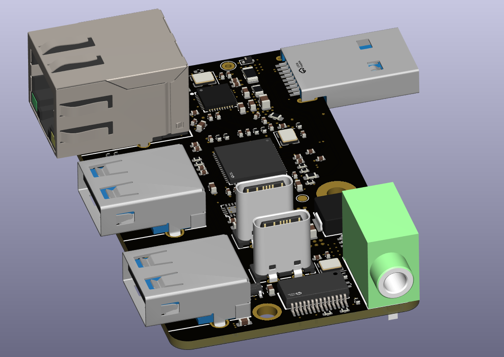
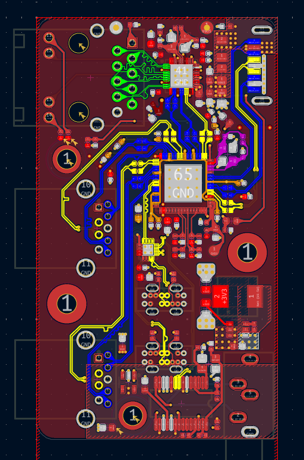
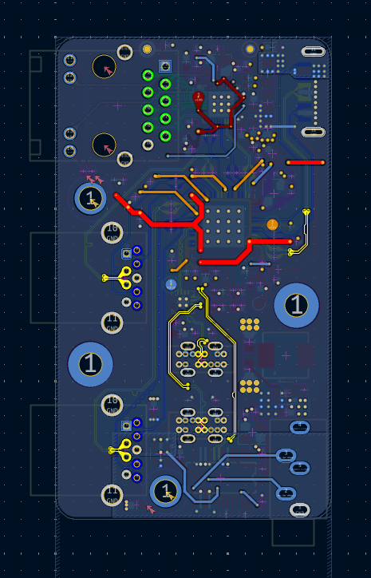
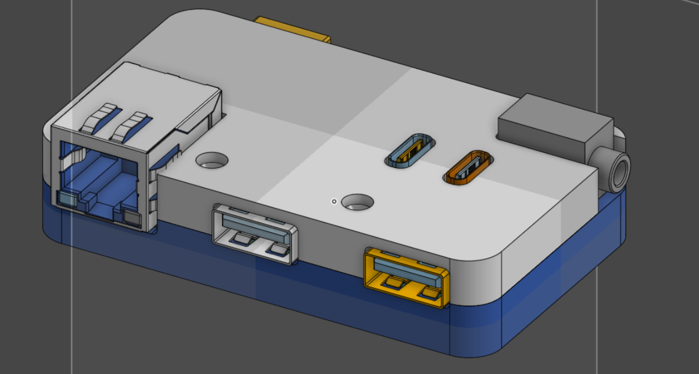
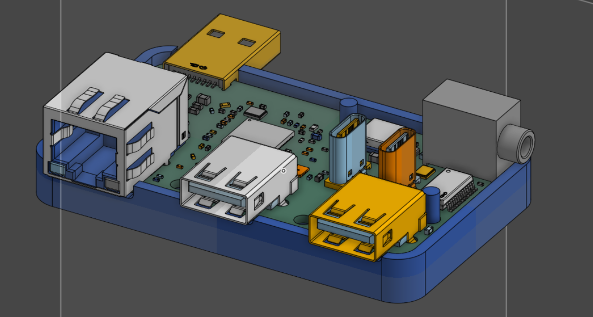
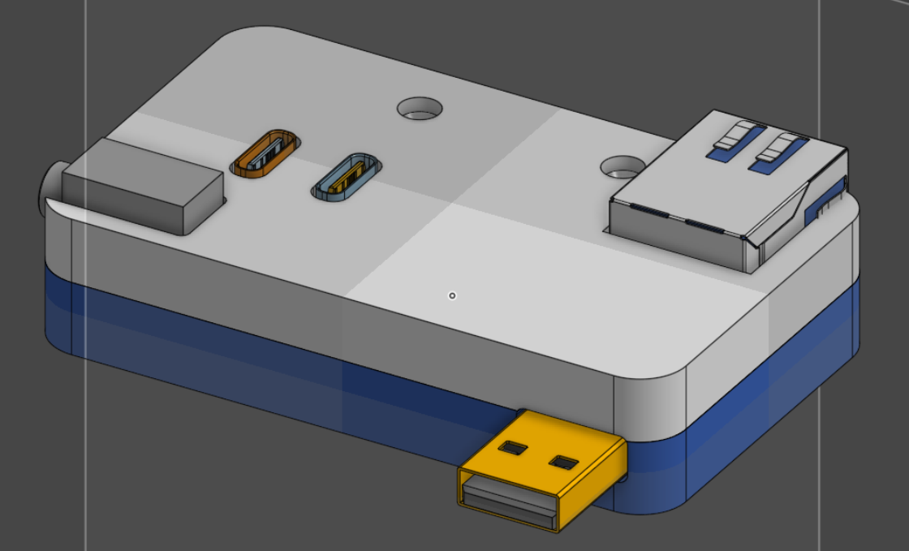
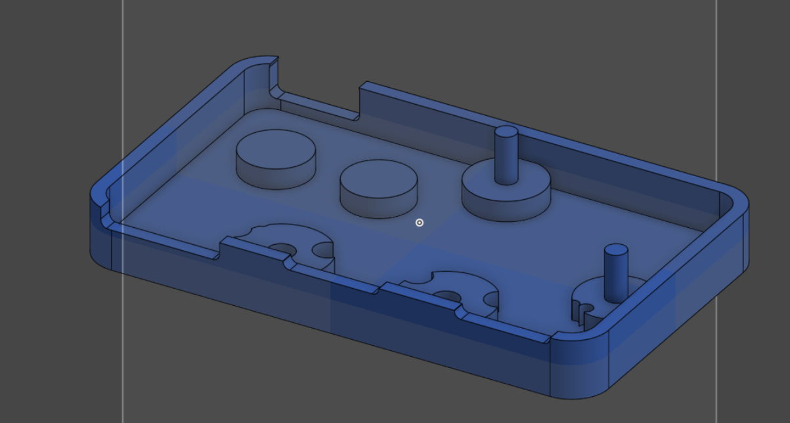
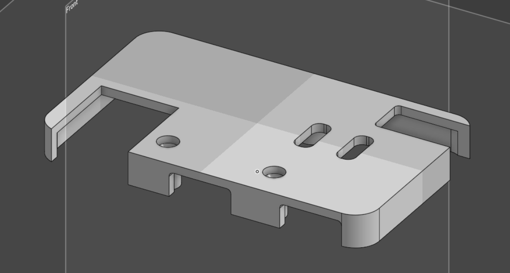
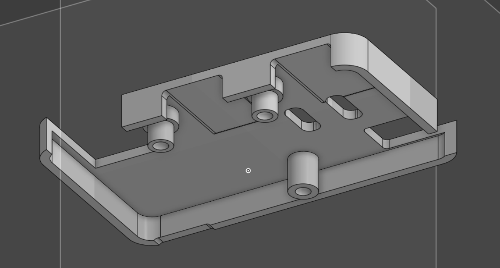

# skibidi thinkbook 14 hub

a very skibidi usb hub to clip on my laptop.

features:
- usb 3.2 gen 1 hub with gigabit ethernet
- 2 usb-a usb 3.2 gen 1 ports
- 2 usb-c usb 2.0 ports
- 3.5mm audio jack.

powered by tusb8042a usb hub controller, rtl8153b gigabit ethernet controller, ch334 usb 2.0 hub controller, and pcm2704 usb dac.

designed in kicad 9

## PCB

## CAD

### Case

### Body

### Top

